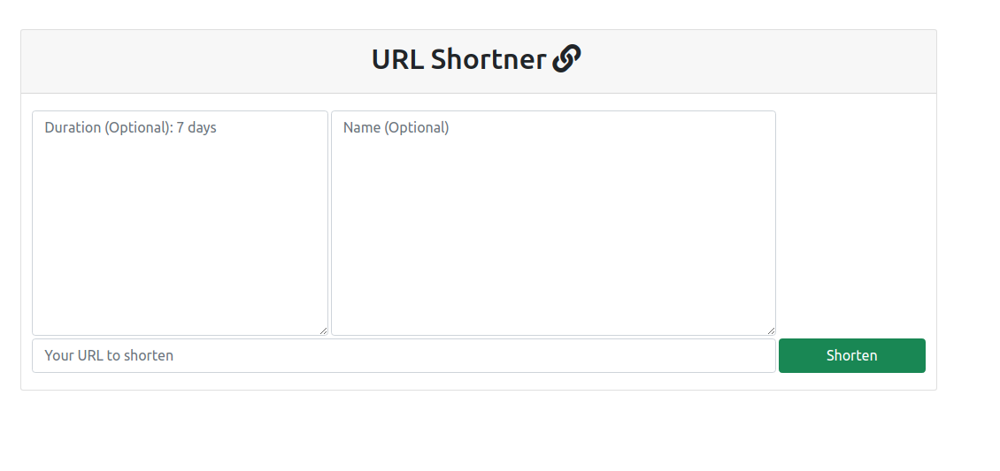
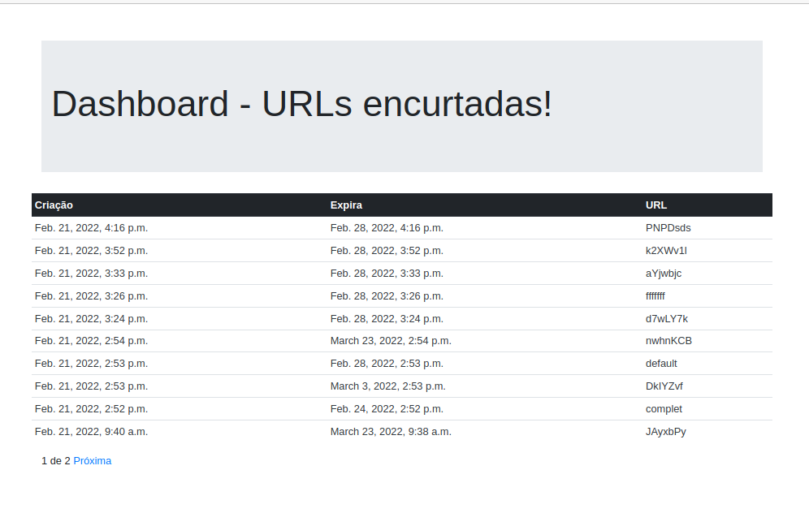

## Description
Webservice application to shorten URL.

The user should input the URL to shorten, optionally him can give a specific name if available, as well to specify expiration time.

## Applications structure

### rsmly
Directory with seetings of django framework for this application

### urlshortener
Main application.



### dashboard
Application that shows the shortened URL. This application needs authentication.



### Access system

#### Run
```
$ python3 manage.py runserver
```

#### Methods and Credentials

credentials for dashboard: admin:admin

* /
* /urlshortener
* /dashboard


## Test

For test use:

```
python3 manage.py test
```

## Database
SQLite database as default, simplicity  question.

## Versions softwares
Python3 3.8.10

Django  4.0.2
